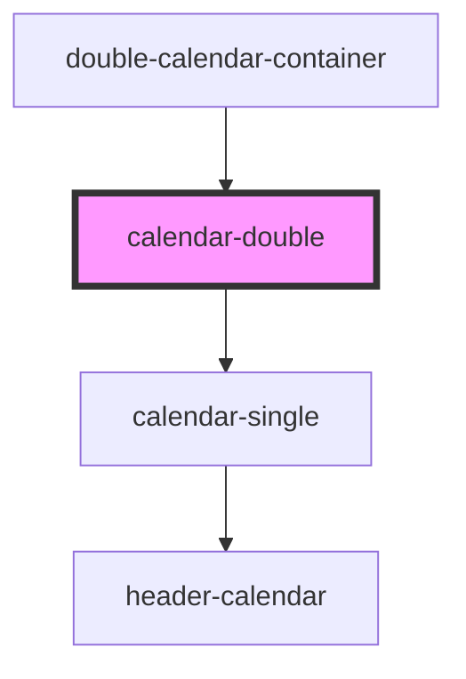

# calendar-double

<!-- Auto Generated Below -->

## Properties

| Property           | Attribute        | Description | Type                              | Default    |
| ------------------ | ---------------- | ----------- | --------------------------------- | ---------- |
| `mainDateReceived` | --               |             | `Date`                            | `null`     |
| `typeSelection`    | `type-selection` |             | `"oneDay" \| "period" \| "range"` | `'oneDay'` |

## Events

| Event                       | Description | Type                           |
| --------------------------- | ----------- | ------------------------------ |
| `dvn-applicationDate`       |             | `CustomEvent<CalendarEntry>`   |
| `dvn-calendarDoubleSetDate` |             | `CustomEvent<CalendarEntry>`   |
| `dvn-rangeDate`             |             | `CustomEvent<CalendarEntry[]>` |

## Dependencies

### Used by

 - [double-calendar-container](../double-calendar-container)

### Depends on

- [calendar-single](../calendar-single)

### Graph

----------------------------------------------

*Built with [StencilJS](https://stenciljs.com/)*
