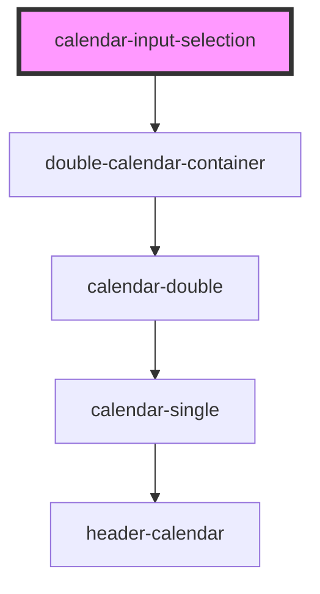

# calendar-input-selection

<!-- Auto Generated Below -->

## Dependencies

### Depends on

- [double-calendar-container](../double-calendar-container)

### Graph

----------------------------------------------

*Built with [StencilJS](https://stenciljs.com/)*
