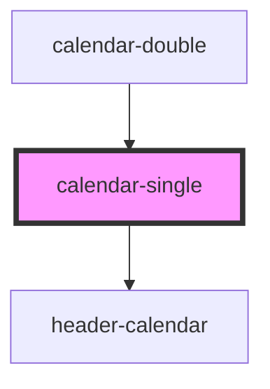

# calendar-single

<!-- Auto Generated Below -->

## Properties

| Property         | Attribute         | Description | Type                              | Default                         |
| ---------------- | ----------------- | ----------- | --------------------------------- | ------------------------------- |
| `calendarActive` | `calendar-active` |             | `boolean`                         | `null`                          |
| `dateCalendar`   | --                |             | `CalendarEntry`                   | `undefined`                     |
| `numberCalendar` | `number-calendar` |             | `"main" \| "secondary"`           | `null`                          |
| `positionRange`  | --                |             | `PositionRange[]`                 | `null`                          |
| `setCalendar`    | --                |             | `CalendarEntry`                   | `{month:11, year:2023, day:19}` |
| `typeSelection`  | `type-selection`  |             | `"oneDay" \| "period" \| "range"` | `'oneDay'`                      |

## Events

| Event                       | Description | Type               |
| --------------------------- | ----------- | ------------------ |
| `dvn-valueCalendarSelected` |             | `CustomEvent<any>` |

## Dependencies

### Used by

 - [calendar-double](../calendar-double)

### Depends on

- [header-calendar](../header-calendar)

### Graph

----------------------------------------------

*Built with [StencilJS](https://stenciljs.com/)*
