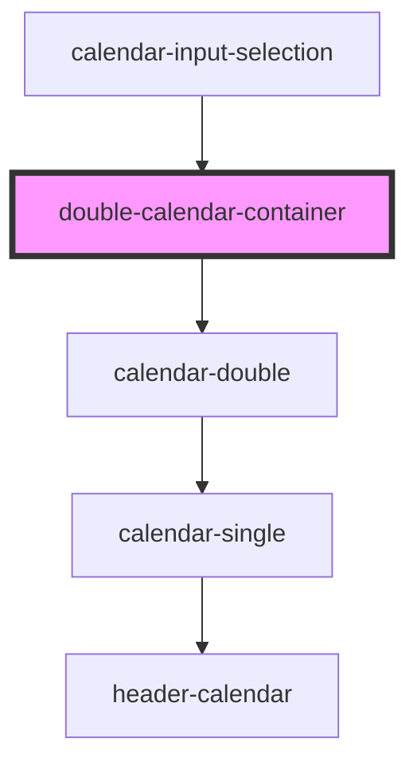

# double-calendar-container

<!-- Auto Generated Below -->

## Events

| Event                        | Description | Type                              |
| ---------------------------- | ----------- | --------------------------------- |
| `dvn-arrayDatesSelected`     |             | `CustomEvent<(string \| Date)[]>` |
| `dvn-changeCleanPeriod`      |             | `CustomEvent<any>`                |
| `dvn-cleanCalendarSelection` |             | `CustomEvent<any>`                |
| `dvn-closeDoubleCalendar`    |             | `CustomEvent<boolean>`            |

## Dependencies

### Used by

 - [calendar-input-selection](../calendar-input-selection)

### Depends on

- [calendar-double](../calendar-double)

### Graph

----------------------------------------------

*Built with [StencilJS](https://stenciljs.com/)*
