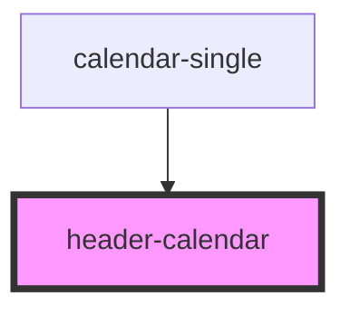

# header-calendar

<!-- Auto Generated Below -->

## Properties

| Property       | Attribute       | Description | Type                | Default     |
| -------------- | --------------- | ----------- | ------------------- | ----------- |
| `nameInactive` | `name-inactive` |             | `boolean`           | `false`     |
| `nameMonth`    | `name-month`    |             | `string`            | `undefined` |
| `position`     | `position`      |             | `"left" \| "right"` | `null`      |
| `twoArrow`     | `two-arrow`     |             | `boolean`           | `false`     |
| `year`         | `year`          |             | `string`            | `undefined` |

## Events

| Event                       | Description | Type               |
| --------------------------- | ----------- | ------------------ |
| `dvn-nextMonthCalendar`     |             | `CustomEvent<any>` |
| `dvn-previousMonthCalendar` |             | `CustomEvent<any>` |

## Dependencies

### Used by

 - [calendar-single](../calendar-single)

### Graph

----------------------------------------------

*Built with [StencilJS](https://stenciljs.com/)*
